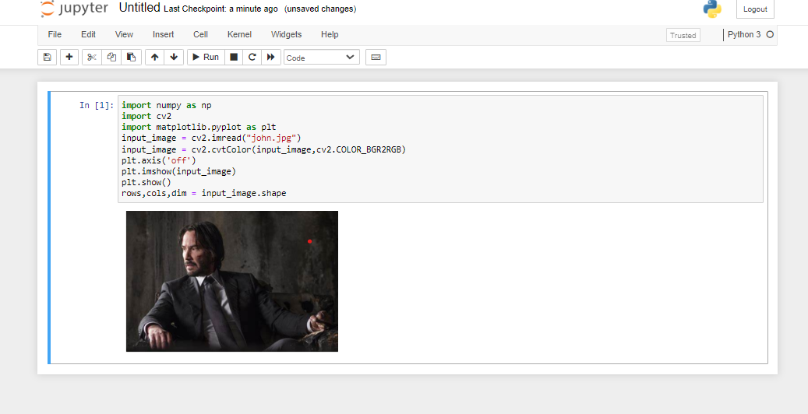
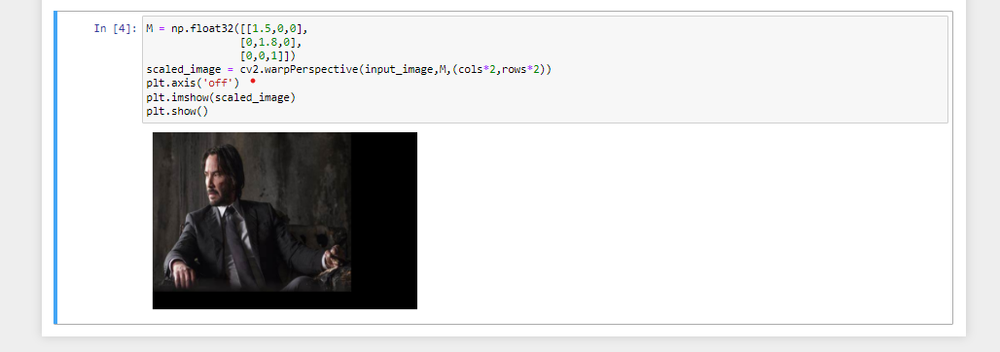
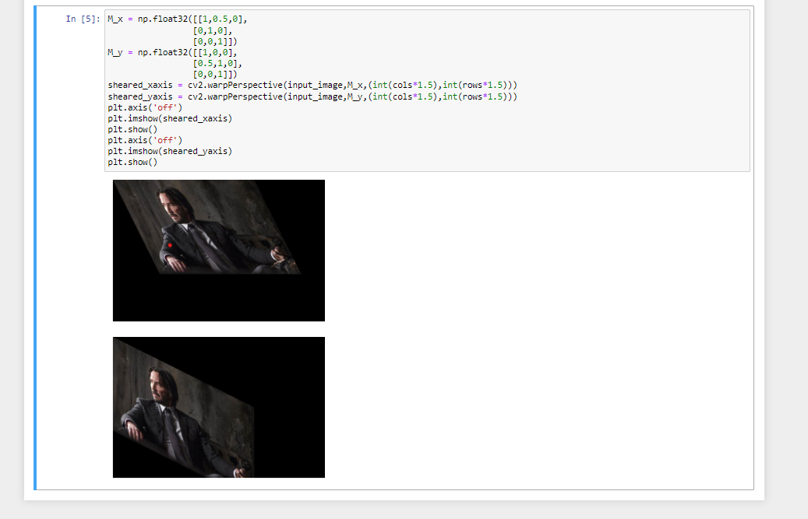
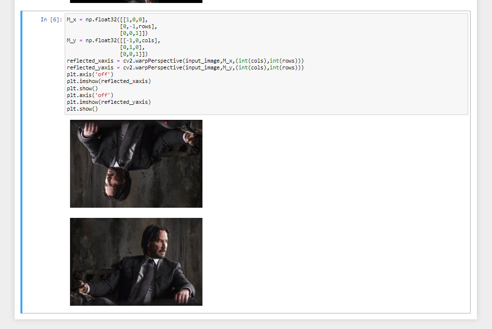
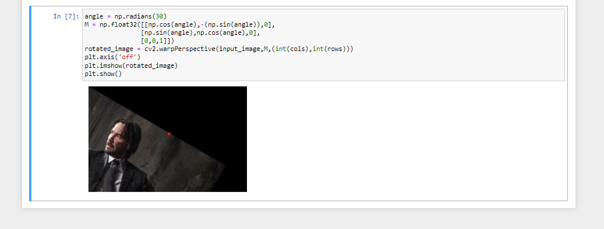

# IMAGE-TRANSFORMATION
## AIM:
To perform image transformation such as Translation, Scaling, Shearing, Reflection, Rotation and Cropping using OpenCV and Python.

## SOFTWARE REQUIRED:
Anaconda - Python 3.7

## ALGORITHM:
### Step1:
Import the necessary libraries and read the original image and save it as a image variable.

### Step 2:
Translate the image using 

M=np.float32([[1,0,20],[0,1,50],[0,0,1]]) 

translated_img=cv2.warpPerspective(input_img,M,(cols,rows))

### Step 3:
Scale the image using 

M=np.float32([[1.5,0,0],[0,2,0],[0,0,1]]) 

scaled_img=cv2.warpPerspective(input_img,M,(cols,rows))

### Step 4:
Shear the image using 

M_x=np.float32([[1,0.2,0],[0,1,0],[0,0,1]]) 

sheared_img_xaxis=cv2.warpPerspective(input_img,M_x,(cols,rows))

### Step 5:
Reflection of image can be achieved through the code 

M_x=np.float32([[1,0,0],[0,-1,rows],[0,0,1]])

reflected_img_xaxis=cv2.warpPerspective(input_img,M_x,(cols,rows))

### Step 6:
Rotate the image using angle=np.radians(45) 

M=np.float32([[np.cos(angle),-(np.sin(angle)),0],[np.sin(angle),np.cos(angle),0],[0,0,1]]) 

rotated_img=cv2.warpPerspective(input_img,M,(cols,rows))

### Step 7:
Crop the image using 

cropped_img=input_img[20:150,60:230]

### Step 8:
Display all the Transformed images and end the program.
## PROGRAM:
Developed By : Shriram R

Register Number : 212221240053

Original image

import numpy as np
import cv2
import matplotlib.pyplot as plt
input_image = cv2.imread("john.jpg")
input_image = cv2.cvtColor(input_image,cv2.COLOR_BGR2RGB)
plt.axis('off')
plt.imshow(input_image)
plt.show()
rows,cols,dim = input_image.shape

i) Image Translation

M = np.float32([[1,0,100],
               [0,1,200],
               [0,0,1]])
translated_image = cv2.warpPerspective(input_image,M,(cols,rows))
plt.axis('off')
plt.imshow(translated_image)
plt.show()

ii) Image Scaling

M = np.float32([[1.5,0,0],
               [0,1.8,0],
               [0,0,1]])
scaled_image = cv2.warpPerspective(input_image,M,(cols*2,rows*2))
plt.axis('off')
plt.imshow(scaled_image)
plt.show()

iii) Image shearing

M_x = np.float32([[1,0.5,0],
                 [0,1,0],
                 [0,0,1]])
M_y = np.float32([[1,0,0],
                 [0.5,1,0],
                 [0,0,1]])
sheared_xaxis = cv2.warpPerspective(input_image,M_x,(int(cols*1.5),int(rows*1.5)))
sheared_yaxis = cv2.warpPerspective(input_image,M_y,(int(cols*1.5),int(rows*1.5)))
plt.axis('off')
plt.imshow(sheared_xaxis)
plt.show()
plt.axis('off')
plt.imshow(sheared_yaxis)
plt.show()

iv) Image Reflection

M_x = np.float32([[1,0,0],
                 [0,-1,rows],
                 [0,0,1]])
M_y = np.float32([[-1,0,cols],
                 [0,1,0],
                 [0,0,1]])
reflected_xaxis = cv2.warpPerspective(input_image,M_x,(int(cols),int(rows)))
reflected_yaxis = cv2.warpPerspective(input_image,M_y,(int(cols),int(rows)))
plt.axis('off')
plt.imshow(reflected_xaxis)
plt.show()
plt.axis('off')
plt.imshow(reflected_yaxis)
plt.show()

v) Image Rotation

angle = np.radians(30)
M = np.float32([[np.cos(angle),-(np.sin(angle)),0],
               [np.sin(angle),np.cos(angle),0],
               [0,0,1]])
rotated_image = cv2.warpPerspective(input_image,M,(int(cols),int(rows)))
plt.axis('off')
plt.imshow(rotated_image)
plt.show()

vi) Image Cropping

cropped_image = input_image[100:300,100:300]
plt.axis('off')
plt.imshow(cropped_image)
plt.show()

## OUTPUT:

### Original image

### i) Image Translation

### ii) Image Scaling

### iii)Image shearing

### iv)Image Reflection

### v)Image Rotation

### vi)Image Cropping

## RESULT: 

Thus, the different image transformations such as Translation, Scaling, Shearing, Reflection, Rotation and Cropping are done using OpenCV and python programming.